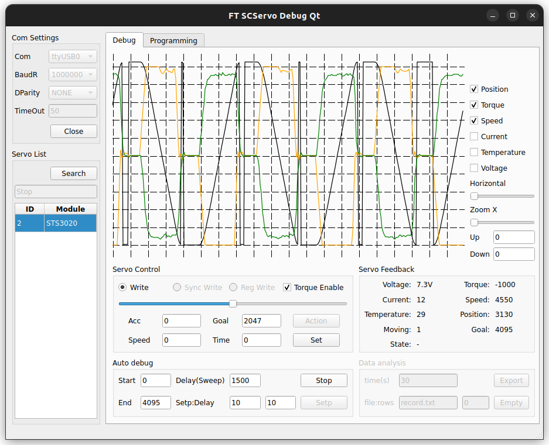
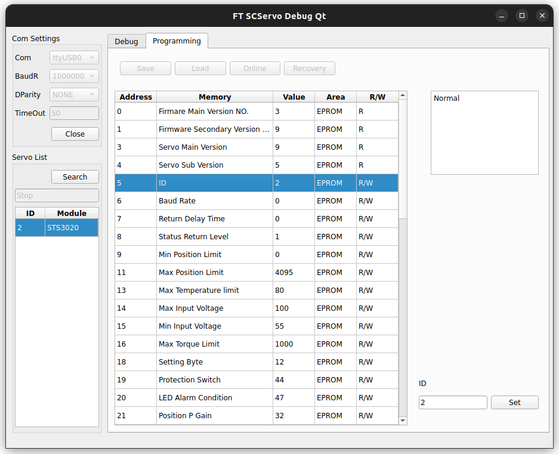

# FT SCServo Debug Qt

Utility for Feetech SCS/STS servo

## Development Env
- Ubuntu 22.04
- Qt Creator 6.0.2

## Dependices for servo board
- CH341 driver

## ⚠️Unported Features⚠️
- Data analisis
- Upgrade tab & features
- PWM tabs & features

## Screenshot

